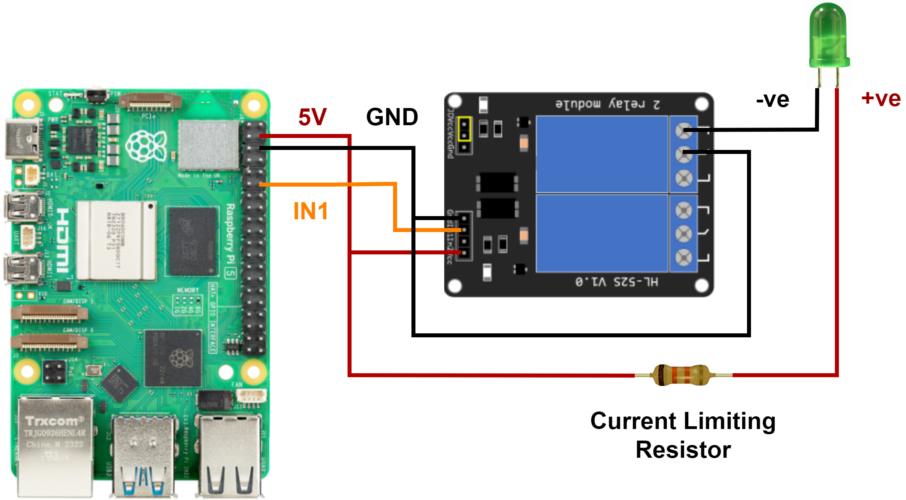

# Voice Assistant with AI
This project uses Rasberry Pi and ChatGPT to create a voice assistant. This voice assistant listens to voice commands and has an interaction with the user, also responding with a voice.

| **Engineer** | **School** | **Area of Interest** | **Grade** |
|:--:|:--:|:--:|:--:|
| Rushil S. | Monta Vista High School | Computer Science | Incoming Sophomore |

<!--
**Replace the BlueStamp logo below with an image of yourself and your completed project. Follow the guide [here](https://tomcam.github.io/least-github-pages/adding-images-github-pages-site.html) if you need help.**
-->


<!--
# Final Milestone

**Don't forget to replace the text below with the embedding for your milestone video. Go to Youtube, click Share -> Embed, and copy and paste the code to replace what's below.**

<iframe width="560" height="315" src="https://www.youtube.com/embed/F7M7imOVGug" title="YouTube video player" frameborder="0" allow="accelerometer; autoplay; clipboard-write; encrypted-media; gyroscope; picture-in-picture; web-share" allowfullscreen></iframe>

For your final milestone, explain the outcome of your project. Key details to include are:
- What you've accomplished since your previous milestone
- What your biggest challenges and triumphs were at BSE
- A summary of key topics you learned about
- What you hope to learn in the future after everything you've learned at BSE


# Second Milestone

**Don't forget to replace the text below with the embedding for your milestone video. Go to Youtube, click Share -> Embed, and copy and paste the code to replace what's below.**

<iframe width="560" height="315" src="https://www.youtube.com/embed/y3VAmNlER5Y" title="YouTube video player" frameborder="0" allow="accelerometer; autoplay; clipboard-write; encrypted-media; gyroscope; picture-in-picture; web-share" allowfullscreen></iframe>

For your second milestone, explain what you've worked on since your previous milestone. You can highlight:
- Technical details of what you've accomplished and how they contribute to the final goal
- What has been surprising about the project so far
- Previous challenges you faced that you overcame
- What needs to be completed before your final milestone 
-->

# First Milestone

<iframe width="935" height="526" src="https://www.youtube.com/embed/qS4kptm6oVI" title="Rushil S. First Milestone" frameborder="0" allow="accelerometer; autoplay; clipboard-write; encrypted-media; gyroscope; picture-in-picture; web-share" referrerpolicy="strict-origin-when-cross-origin" allowfullscreen></iframe>

<h3>Summary</h3>

In my project, I use a USB microphone and a USB speaker. I also have a Raspberry Pi (4) and an HDMI Video Capture device. I use a PiSwitch to control the on and off of the Raspberry Pi as it can go between the power supply and the Raspberry Pi itself. The USB microphone and speaker both connect to the Raspberry Pi and in the future will be used to capture user audio and provide a response. The HDMI Video Capture device is connected to both the Raspberry Pi and the computer. This is so that the Raspberry Pi's interface can be displayed on OBS, which allows for coding the Raspberry Pi, installing dependencies on it, etc. So far I have generated an OpenAI API key for future use when I create the code for the Voice Assistant. I have also installed the OS onto the microSD card for the Raspberry Pi. 

<h3>Challenges</h3>

A big challenge I faced while setting up the Raspberry Pi was the OS on the mircoSD card corrupting. I closed OBS at a point without shutting down my Raspberry Pi and somehow the OS corrupted so I had to restart and reinstall the Raspberry Pi OS onto the microSD card. Another problem I had was the PiSwitch not working, but eventually the PiSwitch fixed itself. My last challenge, which wasn't too big, was related to using OBS as the Raspberry Pi's interface sometimes got stuck on booting, but after the reinstallations of the OS due to the other OBS prblem, the booting problem also was fixed.

<h3>What's Next</h3>

In the future I will install the dependencies onto the Raspberry Pi and build the circuit for the voice assistant which will include an LED to turn on and off using the voice assistant. I will also create the code much later on using the speech recognition libraries and other Raspberry Pi related libraries.



<!--
# Schematics 
Here's where you'll put images of your schematics. [Tinkercad](https://www.tinkercad.com/blog/official-guide-to-tinkercad-circuits) and [Fritzing](https://fritzing.org/learning/) are both great resoruces to create professional schematic diagrams, though BSE recommends Tinkercad becuase it can be done easily and for free in the browser. 

# Code
Here's where you'll put your code. The syntax below places it into a block of code. Follow the guide [here]([url](https://www.markdownguide.org/extended-syntax/)) to learn how to customize it to your project needs. 

```c++
void setup() {
  // put your setup code here, to run once:
  Serial.begin(9600);
  Serial.println("Hello World!");
}

void loop() {
  // put your main code here, to run repeatedly:

}
```

# Bill of Materials
Here's where you'll list the parts in your project. To add more rows, just copy and paste the example rows below.
Don't forget to place the link of where to buy each component inside the quotation marks in the corresponding row after href =. Follow the guide [here]([url](https://www.markdownguide.org/extended-syntax/)) to learn how to customize this to your project needs. 

| **Part** | **Note** | **Price** | **Link** |
|:--:|:--:|:--:|:--:|
| Item Name | What the item is used for | $Price | <a href="https://www.amazon.com/Arduino-A000066-ARDUINO-UNO-R3/dp/B008GRTSV6/"> Link </a> |
| Item Name | What the item is used for | $Price | <a href="https://www.amazon.com/Arduino-A000066-ARDUINO-UNO-R3/dp/B008GRTSV6/"> Link </a> |
| Item Name | What the item is used for | $Price | <a href="https://www.amazon.com/Arduino-A000066-ARDUINO-UNO-R3/dp/B008GRTSV6/"> Link </a> |

# Other Resources/Examples
One of the best parts about Github is that you can view how other people set up their own work. Here are some past BSE portfolios that are awesome examples. You can view how they set up their portfolio, and you can view their index.md files to understand how they implemented different portfolio components.
- [Example 1](https://trashytuber.github.io/YimingJiaBlueStamp/)
- [Example 2](https://sviatil0.github.io/Sviatoslav_BSE/)
- [Example 3](https://arneshkumar.github.io/arneshbluestamp/)

To watch the BSE tutorial on how to create a portfolio, click here.
-->

# Starter Project

<iframe width="935" height="526" src="https://www.youtube.com/embed/4CdzAQ-fwT0" title="Rushil S.  Starter Project" frameborder="0" allow="accelerometer; autoplay; clipboard-write; encrypted-media; gyroscope; picture-in-picture; web-share" referrerpolicy="strict-origin-when-cross-origin" allowfullscreen></iframe>

<h3>Summary</h3>

This project uses a pushbutton to toggle between two LED lights. The pushbutton is connected to a 5V pin, a ground through a resistor, and a digital pin. The digital pin allows for the pushbutton to be used as an input mechanism, as connecting the pushbutton to the digital pin allows for the pushbutton's state (pushed or not) to be continuously read. There are 2 LEDs which both have the same setup in terms of connection to the Arduino board. Each LED has a direct connection to a ground, and then through a resistor, connects to a digital pin. These digital pins allow the LED's state (on or off) to be controlled by the code. All of the cables, resistors, LEDs, and pushbuttons have been soldered into the protoshield. For items that aren't connected in the protoshield (which has specific rows and columns that are automatically connected due to metal lining), solder is used to form those connections between the items. There are pins soldered into the protoshield that extend all analog, digital, etc pins from the Arduino board. 

The code uses setup() to initialize the 2 LEDs as outputs and the pushbutton as an input. This is all done using their ports so the computer understands where the LEDs and pushbutton are. In loop(), the button's current state (pressed or not) is read. Then an if statement checks if the button is being pressed and if this is the first time in the current button press that this if statement is being ran. Then the toggled is swapped (i.e. true -> false) so that based on the toggle, the right LED will be turned on and the right LED will be turned off. This creates a toggling motion for each button press. Finally, the boolean controlling whether the if-statement has already been ran in the button press is set to true, which stops the LEDs from infinitely toggling. Once the button is released (not being pressed), then the boolean controlling whether the if-statement has been ran is set to false so the next time the button is pressed, the LEDs can be toggled. 

<h3>Challenges</h3>

While soldering, a bit of the solder itself spilled onto the middle columns. This caused the entire circuit to short as the 5V and Ground sides were interacting with each other. Another challenge was getting the polarity of the LED correct. At the start, I put the LED the wrong way, not realizing this can cause it to not function. I had to desolder the LED and put it in a new spot, making sure it was placed the right way. An interesting problem I encountered near the end was using pin 13. Pin 13 controls the Arduino Board's LED no matter what, so when I used pin 13 for one of the LEDs, it was not being turned on, instead the board's LED was turning on. 

<h3>What's Next</h3>

In my main project, I will learn how to use and work with Raspberry Pi, and I will learn how to use the OpenAI API. I will figure out how to setup a Raspberry Pi and how to create circuits and code circuits for it.

<h3>Code</h3>

```c++
// constants because they are pin numbers
const int BUTTON_PIN = 7;  // the number of the pushbutton pin
const int LED_PIN =  9;   // the number of the LED pin
const int LED_PIN2 = 13; // number of LED pin # 2
bool isToggled = false; // checks which LED should be turned on (False -> LED 1, True -> LED 2)
bool alreadyRan = false; // checks if loop is running multiple times on one button press so lights don't continuously switch

// buttonstate changes
int buttonState = 0;   // variable for reading the pushbutton status

void setup() {
  // initialize the LED pins as outputs:
  pinMode(LED_PIN, OUTPUT);
  pinMode(LED_PIN2, OUTPUT);
  // initializing the pushbutton as an input device
  // the pull-up input pin will be HIGH when the button is pressed and LOW when the button is not pressed.
  pinMode(BUTTON_PIN, INPUT_PULLUP);
}

void loop() {
  // reads the state of button (pushed/not pushed) --> HIGH/LOW
  buttonState = digitalRead(BUTTON_PIN);
  
  // control LED according to the state of button
  if(buttonState == HIGH && !alreadyRan)         // If button is not pressed
  {
    isToggled = !isToggled; // swaps toggle to other side
    if (isToggled)
    {
      digitalWrite(LED_PIN2, HIGH); // turn on LED # 2
      digitalWrite(LED_PIN, LOW); // turn off LED # 1
    }
    else
    {
      digitalWrite(LED_PIN, HIGH); // turn on LED # 1
      digitalWrite(LED_PIN2, LOW); // turn off LED # 2
    }
    alreadyRan = true; // This will make it so if statement isn't entered multiple times in one button press
  }
  else if (buttonState == LOW)
  {
    alreadyRan = false; // Allows if to be entered again since button has been released now
  }
}
```
